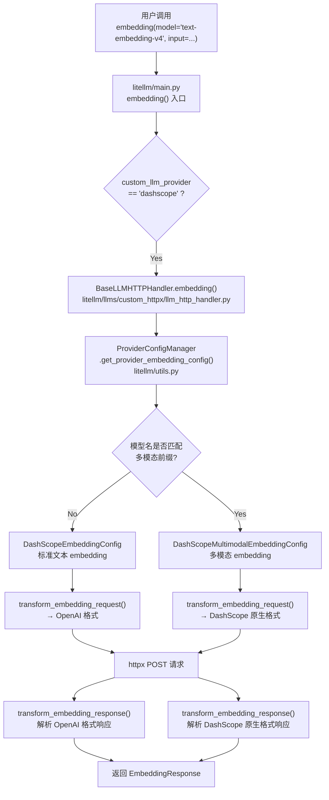
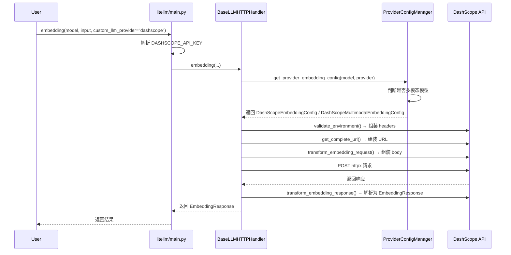
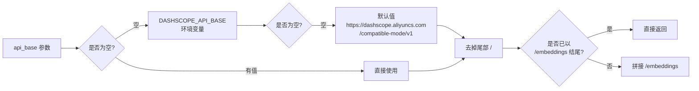
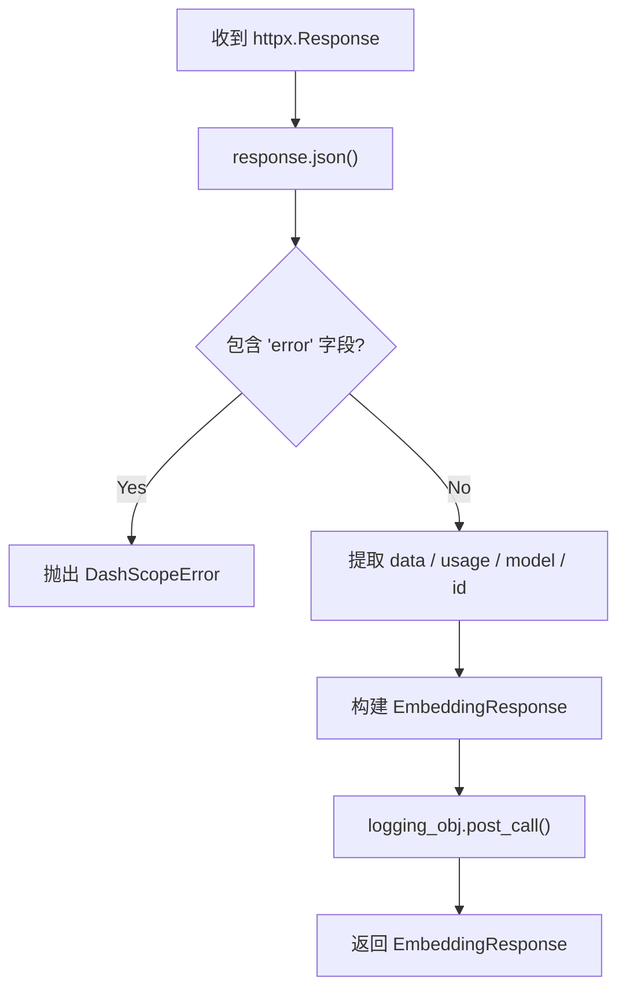
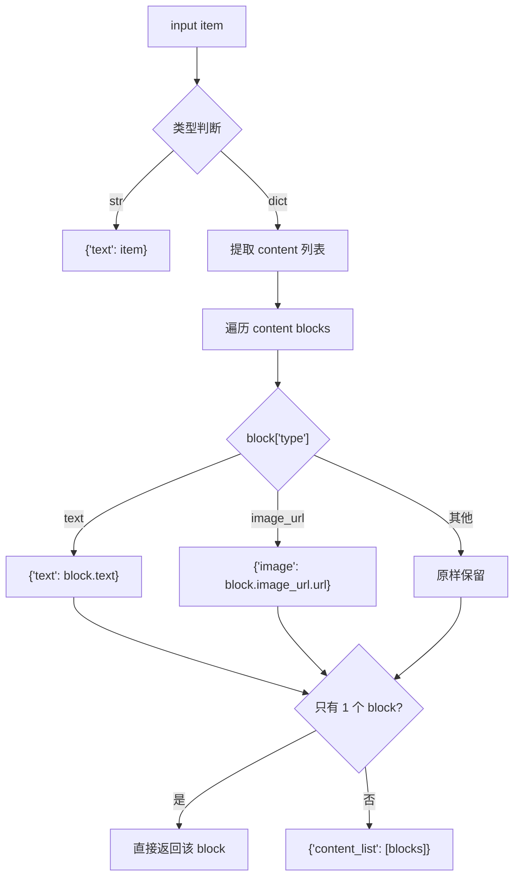
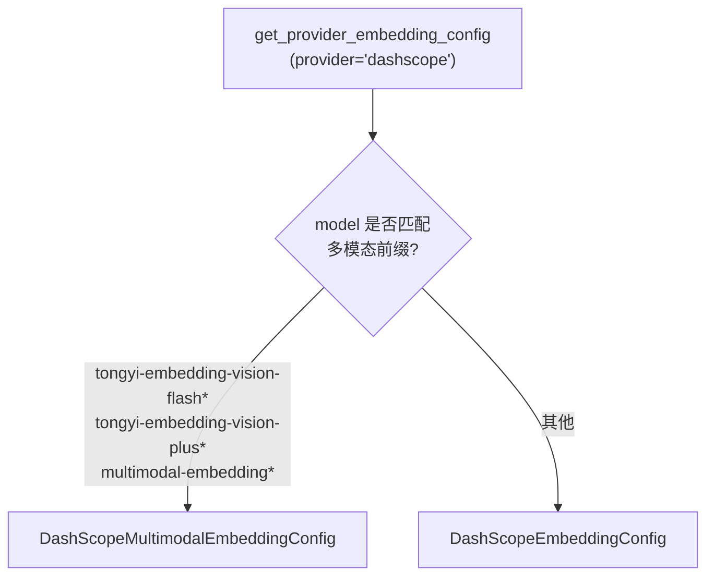

# DashScope Embedding 实现分析

> 基于 litellm 仓库源码分析 DashScope（阿里云通义千问）provider 的 embedding 处理流程。

---

## 1. 整体架构

DashScope 在 litellm 中作为 OpenAI 兼容 provider 接入，但 embedding 分为**两条路径**：

| 路径 | 模型 | API 风格 | 端点 |
|------|------|----------|------|
| **标准文本 Embedding** | `text-embedding-v3`, `text-embedding-v4` | OpenAI 兼容 | `/compatible-mode/v1/embeddings` |
| **多模态 Embedding** | `tongyi-embedding-vision-flash`, `tongyi-embedding-vision-plus` | DashScope 原生 | `/api/v1/services/embeddings/multimodal-embedding/multimodal-embedding` |



---

## 2. 文件结构

```
litellm/llms/dashscope/
├── common_utils.py                      # DashScopeError 异常类
├── cost_calculator.py                   # 分层计费逻辑
├── embed/
│   ├── __init__.py                      # 导出两个 Config 类
│   ├── transformation.py                # 标准文本 embedding (OpenAI 兼容)
│   └── transformation_multimodal.py     # 多模态 embedding (原生 API)
├── chat/
│   └── transformation.py                # Chat 补全配置
├── rerank/
│   └── transformation.py                # Rerank 配置
└── image_generation/
    ├── __init__.py
    └── transformation.py                # 图片生成配置
```

---

## 3. 核心调用链路



---

## 4. 标准文本 Embedding (`transformation.py`)

### 4.1 类定义

```python
class DashScopeEmbeddingConfig(BaseEmbeddingConfig):
```

继承自 `BaseEmbeddingConfig`（`litellm/llms/base_llm/embedding/transformation.py`），该基类定义了 embedding 所需的抽象方法契约。

### 4.2 端点

```
默认: https://dashscope.aliyuncs.com/compatible-mode/v1/embeddings
可覆盖: DASHSCOPE_API_BASE 环境变量
```

URL 组装逻辑（`get_complete_url`）：



### 4.3 支持的 OpenAI 参数

| 参数 | 说明 |
|------|------|
| `dimensions` | 输出向量维度（仅 v3/v4 支持） |
| `encoding_format` | 编码格式（如 `float`） |
| `user` | 用户标识 |

### 4.4 请求转换 (`transform_embedding_request`)

```python
# 输入
model = "text-embedding-v4"
input = ["风急天高猿啸哀"]
optional_params = {"dimensions": 1024, "encoding_format": "float"}

# 输出 (POST body)
{
    "model": "text-embedding-v4",
    "input": ["风急天高猿啸哀"],
    "dimensions": 1024,
    "encoding_format": "float"
}
```

与 OpenAI 的 `/v1/embeddings` 请求格式完全一致。

### 4.5 响应转换 (`transform_embedding_response`)



```python
# DashScope 响应
{
    "data": [
        {"embedding": [0.1, 0.2, ...], "index": 0, "object": "embedding"}
    ],
    "model": "text-embedding-v4",
    "object": "list",
    "usage": {"prompt_tokens": 5, "total_tokens": 5},
    "id": "73591b79-xxxx"
}

# 转换后的 EmbeddingResponse
#   .object = "list"
#   .data = [{"embedding": [...], "index": 0, "object": "embedding"}]
#   .model = "text-embedding-v4"
#   .usage = Usage(prompt_tokens=5, completion_tokens=0, total_tokens=5)
#   .id = "73591b79-xxxx"
```

---

## 5. 多模态 Embedding (`transformation_multimodal.py`)

### 5.1 类定义

```python
class DashScopeMultimodalEmbeddingConfig(BaseEmbeddingConfig):
```

### 5.2 模型识别

```python
DASHSCOPE_MULTIMODAL_EMBEDDING_MODELS = {
    "tongyi-embedding-vision-flash",
    "tongyi-embedding-vision-flash-2026-03-06",
    "tongyi-embedding-vision-plus",
}

@staticmethod
def is_multimodal_embedding(model: str) -> bool:
    base = model.split("/")[-1] if "/" in model else model
    return any(base.startswith(prefix) for prefix in DASHSCOPE_MULTIMODAL_EMBEDDING_MODELS | {"multimodal-embedding"})
```

匹配逻辑：取模型名最后一段（去除 `/` 前缀），检查是否以多模态模型名或 `multimodal-embedding` 开头。

### 5.3 端点

```
默认: https://dashscope.aliyuncs.com/api/v1/services/embeddings/multimodal-embedding/multimodal-embedding
```

注意：多模态走的是**原生 API**，不是兼容模式。

### 5.4 输入归一化 (`_normalize_input_item` / `_normalize_content_blocks`)

这是多模态 embedding 最核心的转换逻辑——将 OpenAI 格式的 content blocks 转为 DashScope 原生格式：



```python
# OpenAI 格式输入
[
    {"type": "text", "text": "描述这张图片"},
    {"type": "image_url", "image_url": {"url": "https://..."}}
]

# 转换后 DashScope 格式
{
    "text": "描述这张图片",
    "image": "https://..."
}

# 或当有多个 block 时:
{
    "content_list": [
        {"text": "描述这张图片"},
        {"image": "https://..."}
    ]
}
```

### 5.5 请求转换 (`transform_embedding_request`)

```python
# 输入
model = "tongyi-embedding-vision-flash"
input = [
    "纯文本输入",
    [
        {"type": "text", "text": "图片描述"},
        {"type": "image_url", "image_url": {"url": "https://example.com/img.jpg"}}
    ]
]
optional_params = {"dimensions": 512}

# 输出 (POST body)
{
    "model": "tongyi-embedding-vision-flash",
    "input": {
        "contents": [
            {"text": "纯文本输入"},
            {
                "content_list": [
                    {"text": "图片描述"},
                    {"image": "https://example.com/img.jpg"}
                ]
            }
        ]
    },
    "parameters": {
        "dimension": 512
    }
}
```

注意：OpenAI 的 `dimensions` 参数被映射为 DashScope 的 `dimension`（单数）。

### 5.6 响应转换

```python
# DashScope 原生响应
{
    "output": {
        "embeddings": [
            {"embedding": [0.1, 0.2, ...]}
        ]
    },
    "usage": {"input_tokens": 50, "total_tokens": 50},
    "request_id": "xxx"
}

# 转换为 OpenAI 兼容格式
#   .object = "list"
#   .data = [
#       {"object": "embedding", "index": 0, "embedding": [0.1, 0.2, ...]}
#   ]
#   .model = "tongyi-embedding-vision-flash"
#   .usage = Usage(prompt_tokens=50, completion_tokens=0, total_tokens=50)
#   .id = "xxx"
```

错误处理方面，多模态 API 返回的错误格式与标准不同——检查 `code` 字段而非 `error` 字段：

```python
if "code" in response_json:
    raise DashScopeError(...)
```

---

## 6. 配置与路由决策

### 6.1 路由逻辑 (`litellm/utils.py:7813-7823`)



### 6.2 环境变量

| 变量 | 用途 |
|------|------|
| `DASHSCOPE_API_KEY` | API 密钥（必填） |
| `DASHSCOPE_API_BASE` | 自定义 API 基础 URL（可选） |

### 6.3 异常处理

```python
class DashScopeError(BaseLLMException):
    """status_code, message, headers"""
```

错误检测：
- 标准文本：检查响应中是否有 `error` 字段
- 多模态：检查响应中是否有 `code` 字段，或 HTTP 状态码非 200

---

## 7. 与 OpenAI Embedding 的对比

| 特性 | OpenAI | DashScope 标准 | DashScope 多模态 |
|------|--------|----------------|------------------|
| API 风格 | 原生 | OpenAI 兼容 | DashScope 原生 |
| 请求格式 | `{input, model}` | 相同 | `{model, input: {contents}}` |
| 多模态 | 不支持 | 不支持 | 支持（文本+图片） |
| dimensions | 支持 | 支持 | 支持（映射为 dimension） |
| 错误格式 | `error` 字段 | `error` 字段 | `code` 字段 |
| 响应结构 | `data[].embedding` | 相同 | `output.embeddings[].embedding` |

---

## 8. 测试覆盖

测试文件：`tests/test_litellm/llms/dashscope/test_dashscope_embedding_transformation.py`

覆盖的测试用例：

| 测试 | 说明 |
|------|------|
| `test_validate_environment_and_url` | 验证 API Key 和 URL 组装 |
| `test_transform_embedding_request` | 标准请求转换 |
| `test_transform_embedding_response_success` | 成功响应解析 |
| `test_transform_embedding_request_user_param` | user 参数传递 |
| `test_map_openai_params_drops_unsupported_with_drop_params` | 不支持的参数被丢弃 |
| `test_transform_embedding_response_error` | 错误响应处理 |

---

## 9. 总结

DashScope 的 embedding 实现遵循 litellm 的 `BaseEmbeddingConfig` 抽象契约，通过 **ProviderConfigManager** 动态路由到正确的配置类。两条路径的设计体现了 DashScope 的演进策略：

1. **标准文本**走 OpenAI 兼容模式，复用已有的 OpenAI 工具链，接入成本最低
2. **多模态**走原生 API，利用 DashScope 独有的多模态能力（文本+图片联合 embedding），同时通过 `_normalize_content_blocks` 将 OpenAI 的 content block 格式转换为 DashScope 原生格式，对上层用户保持接口一致性

整个流程的核心是 **transform_embedding_request → HTTP POST → transform_embedding_response** 三步曲，由 `BaseLLMHTTPHandler.embedding()` 统一编排。
